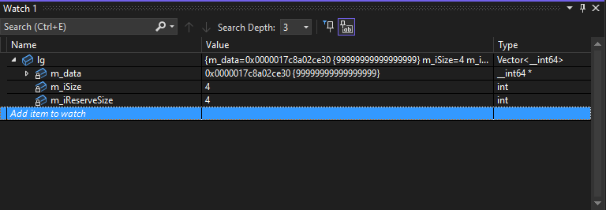

   <h3>Expandable Vector</h3>

Own implementation of a vector class with a visualizer

---

  <h3>Visualizer</h3>

By default visual studio does not support rendering third-party arrays (just like a vector).

Without Natvis:
 </img> 

With Natvis:
 </img> 

---

  <h3>WARNING</h3>

For the visualizer to work for the vector class, you need to move the file 'Vector_.natvis' to 
 '(Drive where VS is installed):\#UserName#\Documents\Visual Studio {Visual Studio version (in my case 2022)}\Visualizers' 
in this folder leave this file, then run the project and in debugging it will work.
 Example path: 'C:\Users\Sergey\Documents\Visual Studio 2022\Visualizers\Vector_.natvis' 
