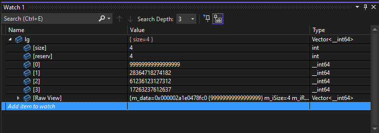

   <h3>Expandable Vector</h3>

Own implementation of a vector class with a visualizer

---

  <h3>Visualizer</h3>

By default visual studio does not support rendering third-party arrays (just like a vector).

Without Natvis:
</img>

With Natvis:
</img>

---
